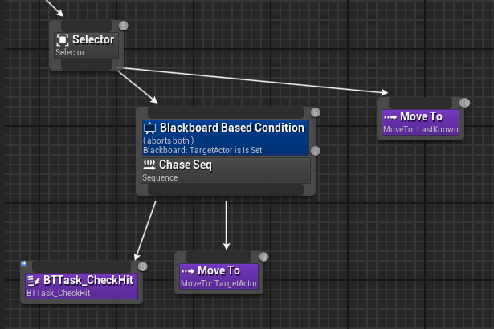
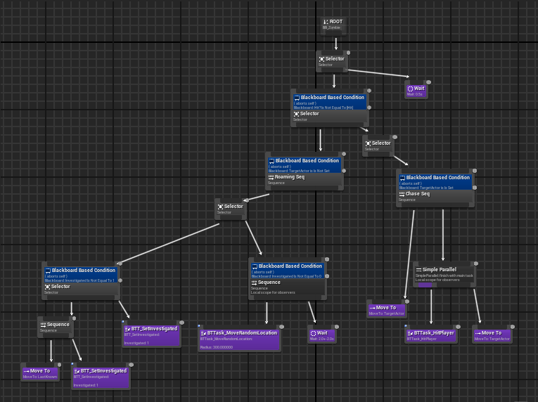

# InteractiveNarritive-Group4
## Research
### AI / Zombies
#### Aims
We want the zombies in the game to have different types which will determine their attributes and behaviors. The types we have come up with as a starting point are:
- Regular: Slow moving, 'traditional' zombies. The majority of the zombies will be this type
- Scouts: Faster zombies with ability to track and follow the player
- Leaders: Similar to regular zombies but more intelligent, with the ability to alert nearby zombies of the player's location.

For these types I will need to research how to adjust the senses and behaviour of AI characters and find out how to allow for some level of communication between them.  

#### Examples
###### The Last of Us
In *The Last of Us (2013)* The zombie like enemies have an in depth progression from when they first get infected and have mostly human characteristics (Runner, 2025). To when they have been infected for much longer and gain abilities such as echolocation and have less human physical characteristics (Clicker, 2025).

*Figure 1 - types of infected in The Last of Us*

In *The Last of Us* the different infected types are gradually introduced in order to create more varied and interesting gameplay and deepen the narrative. Allowing players to learn and their behaviours and the best tactics for dealing with them, as well as learning the reason they exist and have the characteristics they do. 

I believe that this exemplifies an ideal way of implementing different types of enemies. But also makes clear that this works best over a long period of gameplay so that they player can encounter the types one by one before they are combined - avoiding the player feeling overwhelmed or confused. For this reason we may want to consider having more subtle differences between enemies in order to keep the variety and narrative depth, while allowing the player to quickly understand and respond to the types of enemies. 

#### Tutorials and Resources
###### Documentation on AI perception in UE5 (AI Perception in Unreal Engine | Unreal Engine 5.5 Documentation | Epic Developer Community, s.d.)
This documentation goes over the different types of AI perception such as sight, damage and hearing. This can be applied to our zombie AI by allowing us to give the different types of zombies varied abilities in each of these areas of perception - e.g. one type could have very good hearing but bad sight, while another type could have the opposite.

Another key feature detailed in this documentation is AI teams, which is a function allowing AI to create a stimulus to broadcast to nearby AI agents on the same team. This can allow for coordination between enemies - which, in our game, would give the player reason to avoid larger groups of zombies as they will be able to spread information of the player's location.

###### Zombie AI Tutorial (Survival Game - Behaviour Trees & AI Senses (Section 3), s.d.)
This article and videos outline how to set up an AI which detects the player using sight and hearing using C++ and a behaviour tree. It covers important details such as using a custom AnimNotify to trigger the player's footsteps at the right point in their animation. It also shows an example of the AI's behaviour tree which controls what actions the AI performs, such as moving towards the player if they are sensed or patrolling if they are not. Overall, this tutorial gives a very good starting point for the AI in our game that we will be able to build upon to add some complexity and variation in the behaviour of.
- - -
### Combat
#### Aims
While combat is not the focus of the game, and we do not want the player to be able to kill zombies in order to progress, we do want the player to have some options for defending themselves. The methods we plan to experiment with are:
- Slingshot / throwing stones – giving the player a slingshot or something similar that would not do much or any damage to enemies, but would be capable of causing distractions that they player can take advantage of to get past zombies.
- Pushing enemies – we want to give the player a melee attack which allows them to stagger and push back zombies, but not kill them. The purpose of this would be to give the player some agency to get past zombies when they are blocking the path, while keeping them as a formidable threat and meaning that a group of zombies is still very difficult to get through.

#### Examples
###### Spider Man (Marvel’s Spider-Man, 2018)
In the spider Man games, there are stealth missions in which the gameplay is based around avoiding detection and distracting enemies in order to get past them. In these levels, the player has various options such as interacting with environmental objects and performing takedowns on isolated enemies if certain conditions are met.

One element of these levels in the *Spider Man* games that we want to avoid is having the level fail when the player is spotted. This is because we want it to be the player's choice whether they commit fully to stealth or allow themselves to be spotted and attempt to make it past the zombies before they can be caught. We will also likely reduce the player's ability to completely take down enemies, but introduce an attack to briefly push them back or out of the way allowing the player to make a path through enemies to some degree. I think that this will help to mitigate some of the frustration that players find when playing stealth games as it gives them the choice of how to play.

#### Tutorials and Resources
###### Video on Distracting Enemies With Noise (How To Distract An Enemy With Noise | AI Hearing – Unreal Engine 4 Tutorial, 2021)

<iframe width="560" height="315" src="https://www.youtube.com/embed/w0t75DdkazU?si=O9R0JrMeBcF1LWG0" title="YouTube video player" frameborder="0" allow="accelerometer; autoplay; clipboard-write; encrypted-media; gyroscope; picture-in-picture; web-share" referrerpolicy="strict-origin-when-cross-origin" allowfullscreen></iframe>

This video goes over a similar concept to the slingshot we are considering implementing. In the video they demonstrate how to allow the player to throw an object which makes noise, and how to get the AI to then investigate this sound. The steps include, creating the object, then adding an input which spawns the object with a velocity based on the direction the player is facing, and broadcasts a sound which the AI are able to detect upon impact.

###### Video on UE Combat System (How To Create A Melee Combat System in Unreal Engine | Full Tutorial Course, 2023)

<iframe width="560" height="315" src="https://www.youtube.com/embed/wZ11YqdidFA?si=KZgI9RcOPzAjoyLk" title="YouTube video player" frameborder="0" allow="accelerometer; autoplay; clipboard-write; encrypted-media; gyroscope; picture-in-picture; web-share" referrerpolicy="strict-origin-when-cross-origin" allowfullscreen></iframe>

In this video and the following videos in the tutorial series detail creating a melee combat system. The system demonstrated is not quite the same as what we currently have planned for our game – as it allows for the player to defeat the enemies, but we're looking to limit the player's ability to defeat enemies. To make these changes, I will reduce or remove the damage dealt to enemies, as well as increase the hit reaction from enemies to create a more prolonged stagger effect.

### Cutscenes and Quick Time Events
#### Aims
In the game, we want to blend short cutscenes with gameplay to create cinematic moments without making the player feel like they don't have control of the characters' actions for long periods of time. This will allow for dynamic sequences and moments where the narrative can be developed, while keeping the gameplay as the main focus. 

- - -

## Implementation
### Zombie AI
As the zombies will be a core part of the gameplay - being the main obstacle that the player must get around in order to progress the narrative - I have decided to start implementing the zombie AI straight away. This will allow me to develop the AI behaviour and make improvements throughout the project. This is also something new to me so I want to avoid leaving it too late, and not having time to implement the AI the way we want.

#### Initial AI
To begin with I made a simple AI which followed a random roam sequence then chased the player if they could see them. To implement the sight perception I followed this tutorial:

<iframe width="560" height="315" src="https://www.youtube.com/embed/bx7taRBjJgM?si=D0qFL7R-SdOLYg3y" title="YouTube video player" frameborder="0" allow="accelerometer; autoplay; clipboard-write; encrypted-media; gyroscope; picture-in-picture; web-share" referrerpolicy="strict-origin-when-cross-origin" allowfullscreen></iframe>

The AI behaviour tree at this stage consisted of telling the AI to roam to random nearby locations if there was no target player and to chase the target it one was set.

  

#### Combat
As mentioned in my research, I want there to be level of combat that allows the player to stagger the zombies in order to get past them. Below is the blueprint which added ability to attack ai characters

needed to edit logic so that they would stop following the player while their hurt animation played.

<iframe src="https://blueprintue.com/render/ps7foz-s/" scrolling="no" allowfullscreen height="500" width="100%"></iframe>

<iframe src="https://blueprintue.com/render/i5txq92s/" scrolling="no" allowfullscreen height="500" width="100%"></iframe>

mistake in logic caused the ai to lose track of the player if hit, meaning it would go back to roaming randomly.

#### Alerting others
When a zombie spots the player, I want them to alert all the surrounding zombies

### Autofocusing
#### Problem
The autofocusing depth of field system functions correctly when moving to focus on a closer object. However, when the focus shifts to an object which is further away, there is no gradual transition.

After testing the issue in different scenarios, I found that the problem was generally caused when there was a big difference in the original to the target focus distance. This showed that the issue was not that the transition was not happening, but that it was happening too quickly. Therefore, in order to fix the issue, I was able to limit the maximum focus distance so that it was never transitioning too far. This made the effect look much smoother.

### Interactions

I created a mechanic which allows items to be interacted with, the purpose of this is to allow players to investigate certain items which will contain information about the game world which is not important to the gameplay, but adds environmental storytelling for players who are interested in learning the backstory and additional information about the game. The effect uses the line trace created by the depth of field system to check if the item that the player is looking at is able to be interacted with, then applies an outline material to the object if it is. To create the outline material, I followed the following tutorial:

<iframe width="560" height="315" src="https://www.youtube.com/embed/rGqlReFObYQ?si=FgYwc6mj9f51My-i" title="YouTube video player" frameborder="0" allow="accelerometer; autoplay; clipboard-write; encrypted-media; gyroscope; picture-in-picture; web-share" referrerpolicy="strict-origin-when-cross-origin" allowfullscreen></iframe>

Then when the player presses the interact key, the item is lifted to be in front of the player and rotated to face them using position and rotation lerps. The player is then able to rotate the item in the air using the mouse, meaning they are able to view it from whatever angle they want to. while the item is being interacted with, the player movement and rotation is locked to avoid any issues, then when the player presses the interact key again the item is returned to its original position and rotation. 

### Critical Reflection

#### Teamwork
Our team started off very well, with a wide variety of ideas for the game, followed by solid research completed by each member of the group. The team leader also set us a deadline for the research to be completed, which helped encourage progress to be made immediately. Moving into the development of the game, we started to have issues where people had slightly different ideas of what exactly the game would be and what the timeline for development was. Personally, I think I could have done a better job at explaining to the team what I was working on at any given time and getting our work put together much more frequently so that it did not become a job for the final weeks - in which a number of the team were unable to be as involved as planned due to illness and various commitments. This lead to me being largely responsible for polishing the game and getting it to a point where it could be played and I did not have enough time to include all the planned features. Some of the mechanics I had put time into were also left largely unused in the final product due to me having to work on different areas of the game towards the end of the project.
For example, item interactions were planned to be a method for environmental storytelling where the player could inspect items which contained hints to the narrative of the game and deeper story elements. And while the mechanic was fully functioning, communication between the group had not been good enough so we did not have any item models which would serve this purpose.

To avoid similar issues in future group projects, I will take on more responsibility for keeping everyone updated on each other's progress and when they are planning to complete work, as well as when they will be unavailable. This would allow for more collaboration throughout the project, which would help to improve the quality of work produced. 

## Bibliography